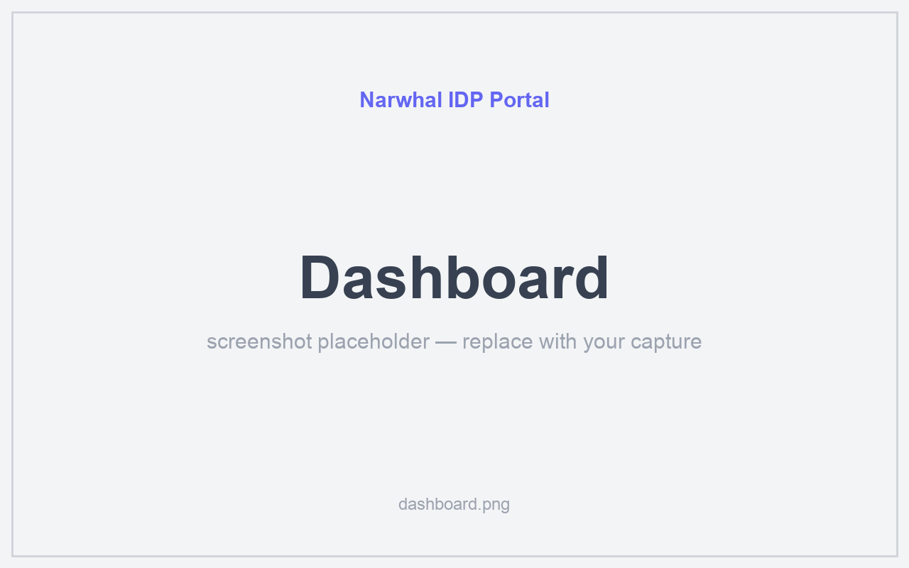
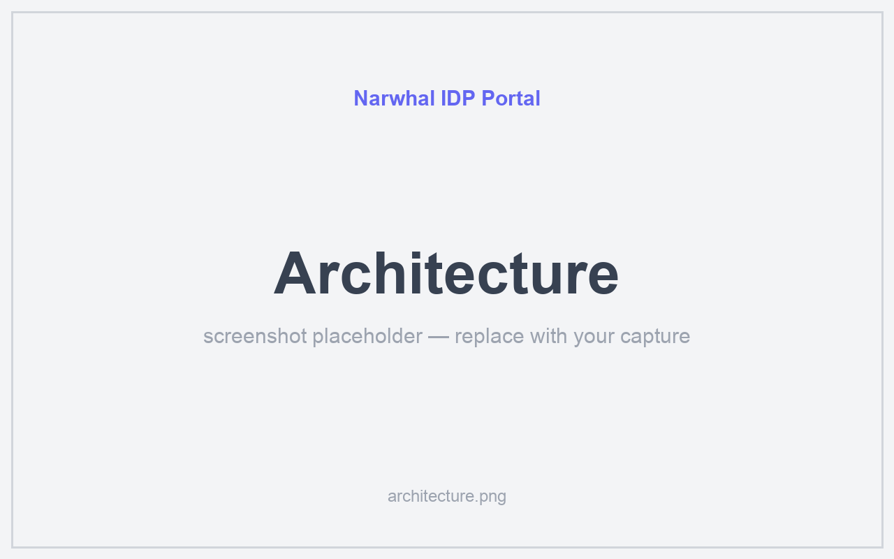
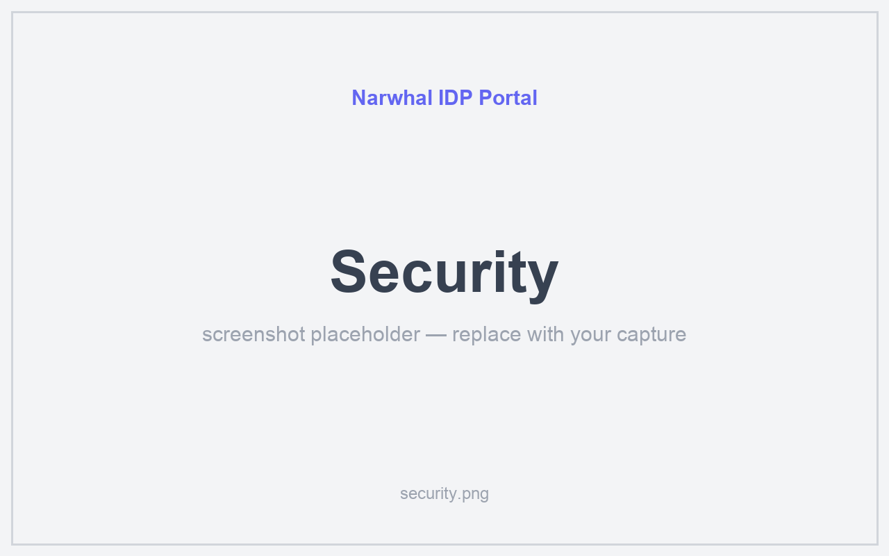
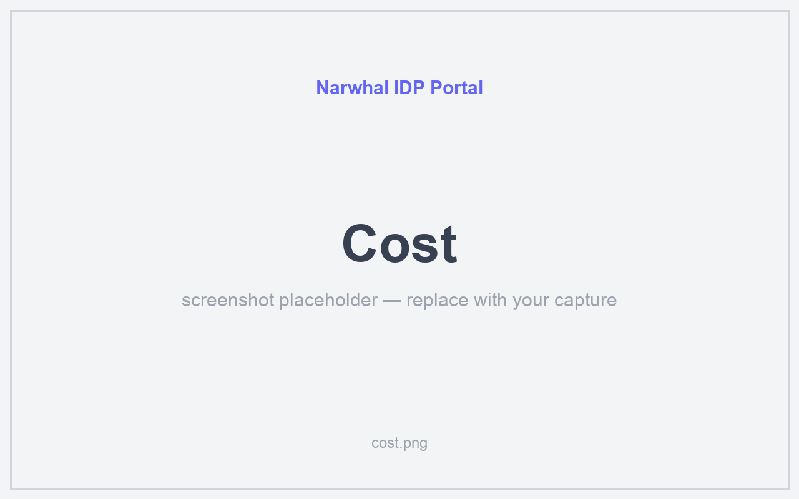
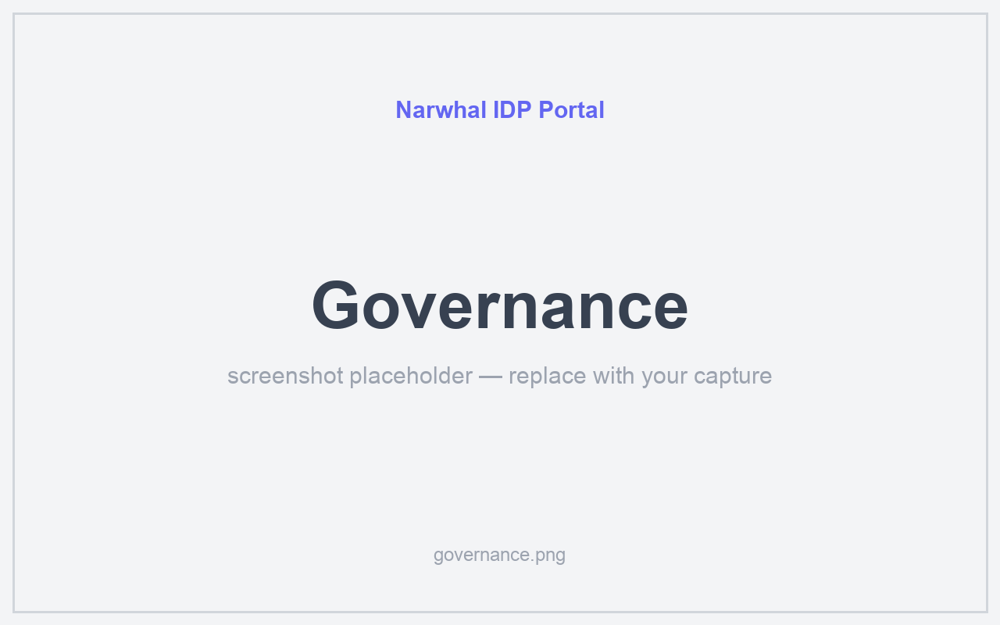
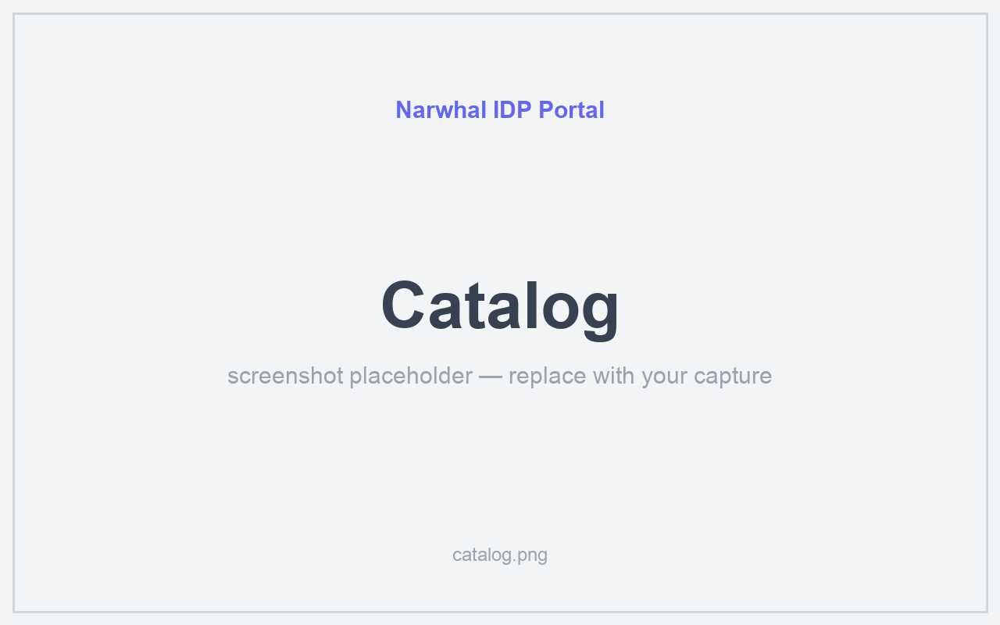

# Narwhal IDP Portal

[English](README.md) | 한국어

**Narwhal Kubernetes Internal Developer Platform (IDP)** 클러스터용 관리 포탈(Next.js)입니다.
형제 레포지토리인 `../narwhal`이 클러스터 자체(GitOps, SSO, 모니터링, 스토리지)를 프로비저닝하며,
이 레포지토리는 운영자와 개발자가 클러스터를 관찰하고 운영하는 데 사용하는 웹 UI입니다.

클러스터의 APISIX 게이트웨이를 통해 클러스터 내부에서 **https://portal.local.narwhal.internal** 주소로 서비스됩니다.

## Key Features

- **Dashboard** — 클러스터 헬스, ArgoCD 앱 상태, 경고/알림 (`src/app/(dashboard)/page.tsx`)
- **Onboarding** — kubeconfig 발급, 시작 가이드 (`onboarding/`)
- **Catalog / My Apps** — 배포된 서비스 카탈로그, 사용자별 앱 뷰 (`catalog/`, `my-apps/`)
- **Nodes** — 클러스터 노드 인벤토리 및 상태 (`nodes/`)
- **Cost** — 비용 시각화/가시성 (`cost/`)
- **Compliance / Security / Governance** — 정책, RBAC, 감사(audit) 뷰 (`compliance/`,
  `security/`, `governance/`)
- **Architecture / Templates / Tools** — 서비스 그래프, 템플릿(scaffolding templates), 플랫폼 도구
  그리드 (`architecture/`, `templates/`, `tools/`)
- **Settings** — 사용자, 라우트, 인증서, 정책

라우트는 `src/app/(dashboard)/` 아래에 위치하며, 이를 지원하는 API 라우트는 `src/app/api/` 아래에 위치합니다.

## Screenshots

> 자리표시 갤러리 — 캡쳐 PNG를 [`docs/images/`](docs/images/)에 아래 파일명으로 넣으면 자동 렌더됩니다 ([상세·팁](docs/images/README.md)).

| 대시보드 | 아키텍처 |
| :---: | :---: |
|  |  |
| _실시간 메트릭·ArgoCD 앱·알럿_ | _노드·네임스페이스·서비스 그래프_ |
| **보안** | **비용** |
|  |  |
| _Trivy 취약점 리포트_ | _네임스페이스 비용 분석_ |
| **거버넌스** | **카탈로그** |
|  |  |
| _스코어카드·DORA·분포_ | _셀프서비스 앱 카탈로그_ |

## Tech Stack

| 레이어 | 기술 |
|-------|------------|
| 프레임워크 | Next.js 16 (App Router) + React 19 |
| 스타일링 | TailwindCSS 4 + shadcn/ui |
| 데이터 | TanStack Query (서버) + Zustand (클라이언트) |
| 인증 | NextAuth 5 (베타) + Keycloak OIDC |
| 캐시 | Valkey (ioredis) |
| 시크릿 | OpenBao Agent Injector |
| 패키지 매니저 | pnpm (`pnpm@10.27.0`, `packageManager`를 통해 고정됨) |
| 테스트 | Vitest + Playwright (계획됨 — 아직 구현되지 않음) |

## Quick Start

```bash
pnpm install
pnpm dev
```

http://localhost:3000 을 엽니다. 클린 설치(clean-install) 환경에서의 시크릿 부트스트랩
(`AUTH_SECRET`, `VALKEY_PASSWORD`, Keycloak/OpenBao/ArgoCD 자격 증명)에 관한 내용은
[docs/security-clean-install.md](./docs/security-clean-install.md) 문서를 참고하시고,
먼저 `bash scripts/bootstrap-secrets.sh`를 실행하세요.

## Build & Deploy

### Host build

```bash
pnpm build   # next build
pnpm start   # next start
```

프로덕션용 Docker 이미지는 `make build` / `make push` / `make all` 명령을 사용하여 로컬에서도 빌드할 수 있습니다.
(Docker Desktop이 필요하며, `harbor.local.narwhal.internal`로 푸시됩니다.)

### In-cluster Kaniko build (no local Docker required)

클러스터가 Kaniko를 통해 자체적으로 이미지를 빌드하고 푸시하므로, 일반적인 배포 시에는
로컬 Docker 데몬이 필요하지 않습니다:

```bash
./scripts/kaniko-build.sh
```

이 스크립트는 현재 소스를 클러스터 내부 Gitea에 푸시하고, Kaniko `Job` 템플릿
(`deploy/kaniko-build-job.yaml`)을 적용한 다음, 빌드가 완료되어
`harbor.local.narwhal.internal/library/narwhal-portal:latest`로 푸시될 때까지 대기합니다.
이미 Gitea에 푸시된 소스를 재사용하려면 `--skip-push` 옵션을 전달하세요.

### Live development (Skaffold + HMR)

핫 리로드가 포함된 클러스터 내부 반복 개발(로컬 Docker/Node 실행이 전혀 필요 없음)에 대해서는
**[docs/local-dev.md](./docs/local-dev.md)** 문서를 참고하세요. 이 문서에서는 `pnpm run dev:skaffold`,
Node 인스펙터를 사용한 디버깅, IntelliJ/VS Code 연동 등을 다룹니다.

## Development Commands

```bash
pnpm dev              # local dev server
pnpm build            # production build
pnpm run dev:skaffold # in-cluster HMR dev loop (Skaffold + Kaniko)
pnpm run harbor:setup # one-time Kaniko/Harbor auth secret bootstrap
npx tsc --noEmit      # type check
npx shadcn@latest add {component}  # add a shadcn/ui component
```

## Related Docs

- [docs/local-dev.md](./docs/local-dev.md) — 전체 Skaffold/Kaniko 개발 워크플로우, 트러블슈팅
- [docs/security-clean-install.md](./docs/security-clean-install.md) — 클린 설치 시크릿 및
  보안 강화 체크리스트
- `CLAUDE.md` — AI 지원 개발을 위한 아키텍처, 에이전트 하네스 및 컨벤션
