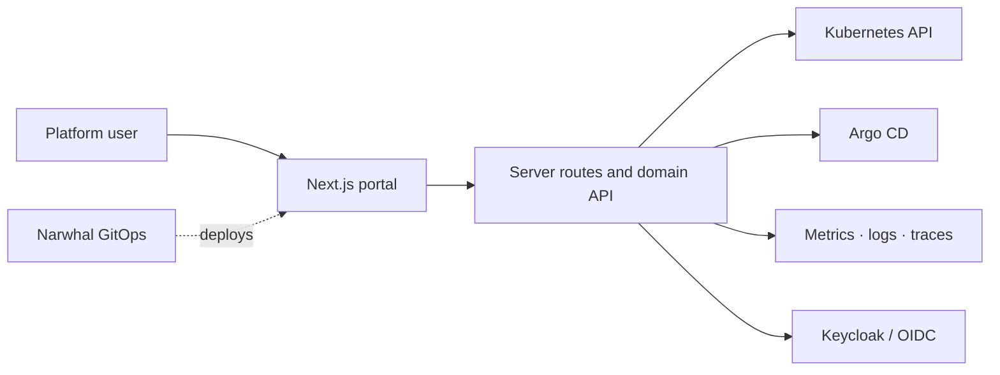
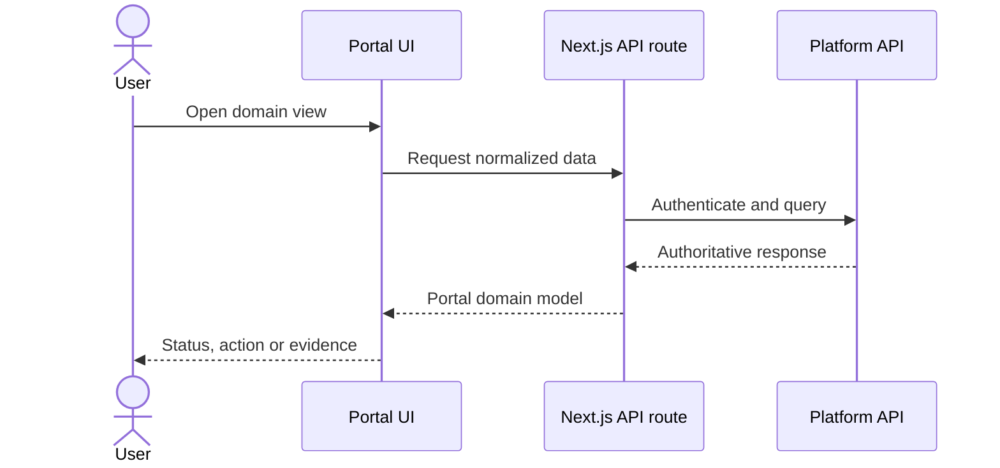

# Architecture

Narwhal Portal is the user-facing control surface for a Narwhal platform. It presents cluster, delivery, security, cost and observability data through one domain-oriented UI without replacing the systems that remain authoritative for that data.

## System context

The portal reads and orchestrates platform APIs. Kubernetes, Argo CD, the identity provider and observability backends remain systems of record.

## Application layers

| Layer | Source | Responsibility |
|---|---|---|
| Routes and layouts | `src/app/` | Dashboard navigation, login and server-rendered pages |
| API boundary | `src/app/api/` | Health, cluster, catalog, templates, scorecards, cost, security and telemetry endpoints |
| UI composition | `src/components/` | Reusable visual and domain components |
| Client state | `src/hooks/`, `src/lib/` | Fetching, normalization, auth helpers and domain clients |
| Contracts | `src/types/`, `protos/` | TypeScript and flow/observer/relay integration contracts |
| Runtime packaging | `deploy/`, `config/` | Container deployment and environment-specific configuration |

## Request flow

## Trust and deployment boundaries

- Browser code never receives Kubernetes service-account credentials.
- Server routes are the integration boundary for cluster and platform APIs.
- OIDC establishes user identity; authorization is still checked at the called service.
- Runtime configuration is injected through deployment resources, not bundled into the UI.
- Correlated data with uncertain relationships is labeled instead of presented as authoritative.

## Relationship to Narwhal

This repository owns portal code and packaging. The [Narwhal repository](https://github.com/dasomel/narwhal) owns cluster provisioning, GitOps applications, gateways, identity and platform services. A new cluster capability therefore needs a portal contract here and deployment/configuration in Narwhal separately.

