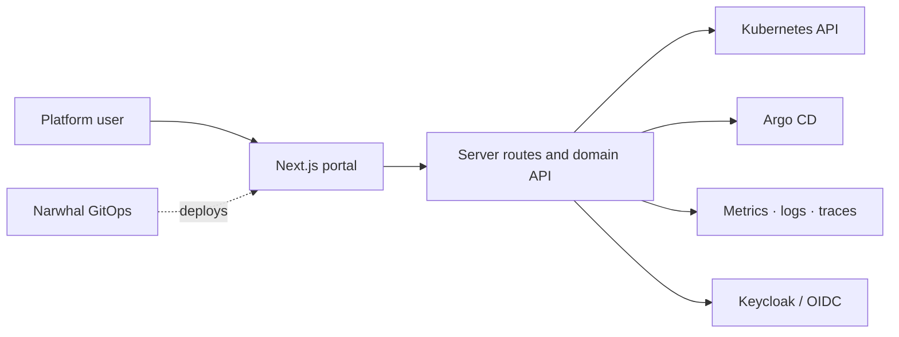
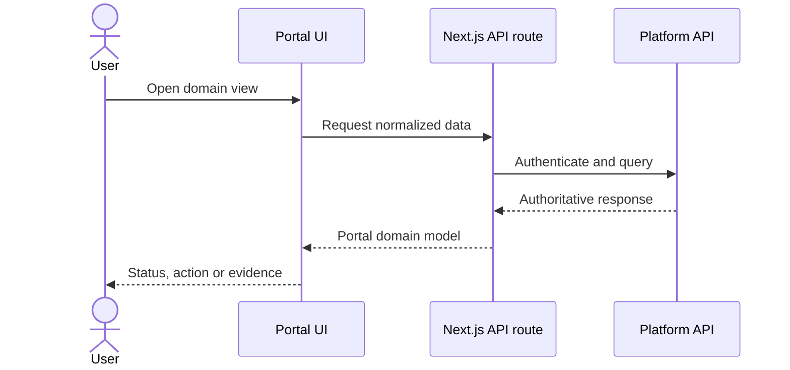

# Architecture

Narwhal Portal is the user-facing control surface for a Narwhal platform. It presents cluster, delivery, security, cost and observability data through one domain-oriented UI without replacing the systems that remain authoritative for that data.

## System context

```mermaid
flowchart LR
    U["Platform user"] --> W["Next.js portal"]
    W --> B["Server routes and domain API"]
    B --> K["Kubernetes API"]
    B --> G["Argo CD"]
    B --> O["Metrics · logs · traces"]
    B --> I["Keycloak / OIDC"]
    N["Narwhal GitOps"] -. deploys .-> W
```

The portal reads and orchestrates platform APIs. Kubernetes, Argo CD, the identity provider and observability backends remain systems of record.

## Application layers

| Layer | Source | Responsibility |
|---|---|---|
| Routes and layouts | `src/app/` | Dashboard navigation, login and server-rendered pages |
| API boundary | `src/app/api/` | Health, cluster, catalog, templates, scorecards, cost, security and telemetry endpoints |
| UI composition | `src/components/` | Reusable visual and domain components |
| Client state | `src/hooks/`, `src/lib/` | Fetching, normalization, auth helpers and domain clients |
| Contracts | `src/types/`, `protos/` | TypeScript and flow/observer/relay integration contracts |
| Runtime packaging | `deploy/`, `config/` | Container deployment and environment-specific configuration |

## Request flow

```mermaid
sequenceDiagram
    actor User
    participant UI as Portal UI
    participant API as Next.js API route
    participant Source as Platform API
    User->>UI: Open domain view
    UI->>API: Request normalized data
    API->>Source: Authenticate and query
    Source-->>API: Authoritative response
    API-->>UI: Portal domain model
    UI-->>User: Status, action or evidence
```

## Trust and deployment boundaries

- Browser code never receives Kubernetes service-account credentials.
- Server routes are the integration boundary for cluster and platform APIs.
- OIDC establishes user identity; authorization is still checked at the called service.
- Runtime configuration is injected through deployment resources, not bundled into the UI.
- Correlated data with uncertain relationships is labeled instead of presented as authoritative.

## Caching contract

Every Valkey cache key (`src/lib/valkey.ts`'s `cacheGet`/`cacheSet`/`cacheDel`) is built from
explicit named dimensions in [`src/lib/cache-keys.ts`](../src/lib/cache-keys.ts) — namespace,
schema version, `cluster_id` (via `clusterCacheKey`, `src/lib/cluster-registry.ts`), and
authorization scope (via `EffectiveScope.fingerprint`, `src/lib/scope.ts`) — rather than a
hand-written template string per route. `CACHE_NAMESPACES` in that module is the full documented
contract (dimensions / TTL / invalidation trigger / whether a partial provider response is ever
cached) for every namespace in the codebase, and
[`cache-keys.contract.test.ts`](../src/lib/cache-keys.contract.test.ts) enforces it: every
namespace whose cached value differs by caller identity, team, role, or cluster must carry a
matching dimension, and no namespace caches a failed/partial provider fetch.

`src/lib/argocd.ts`, `src/lib/gitea.ts`, `src/lib/http-client.ts`, and `src/lib/keycloak-client.ts`
(`KEYCLOAK_CACHE_KEYS`, already centralized per #49) own their own key construction and are
referenced in the registry for completeness rather than migrated into this module.

## Outbound HTTP transport policy

Outbound HTTP calls to platform dependencies (Argo CD, Gitea, Prometheus, Keycloak, APISIX,
Kubernetes API, OpenBao, Alertmanager, Falco/Loki) are standardized through the shared transport
client in [`src/lib/http-client.ts`](../src/lib/http-client.ts).

Detailed transport reference and matrix: [`docs/outbound-http-policy.md`](./outbound-http-policy.md).

### Transport guarantees and error model

- **Transport failures (`HttpClientError`)**: Transport-level failures throw `HttpClientError`
  ([`src/lib/http-client.ts:98-116`](../src/lib/http-client.ts#L98-L116)) with normalized
  `kind: HttpClientErrorKind` (`"timeout" | "network" | "aborted"`,
  [`src/lib/http-client.ts:90`](../src/lib/http-client.ts#L90)).
- **HTTP status responses**: Non-retried HTTP status outcomes (including 401, 403, 500, and
  exhausted 429/502/503/504) return the `Response` object
  ([`src/lib/http-client.ts:350-353, 413`](../src/lib/http-client.ts#L350-L353)). Callers evaluate
  `response.ok` or `response.status` according to domain requirements.
- **Redaction**: URL query parameters and user credentials (`scheme://user:pass@`) are stripped
  via `redactUrl()` ([`src/lib/http-client.ts:122-134`](../src/lib/http-client.ts#L122-L134)). Headers
  (such as `Authorization` or `X-Vault-Token`) are never leaked into `HttpClientError.message`, but
  the original runtime error is preserved as `cause` ([`src/lib/http-client.ts:114, 425`](../src/lib/http-client.ts#L114));
  callers must not log `cause` wholesale if it can carry sensitive data.
- **Deadline-bounded body reads**: `fetchWithPolicy` records remaining attempt time
  `Math.max(0, timeoutMs - elapsed)` in `bodyDeadlines`
  ([`src/lib/http-client.ts:252, 412-413`](../src/lib/http-client.ts#L252)). Bodies read via
  `readJsonWithPolicy` ([`src/lib/http-client.ts:338`](../src/lib/http-client.ts#L338)) or
  `readTextWithPolicy` ([`src/lib/http-client.ts:343`](../src/lib/http-client.ts#L343)) must complete
  within that budget; stalled streams are aborted and throw `kind: "timeout"`.
- **Response byte-size limits**: Body-read time is deadline-bounded; response byte sizes are
  currently unbounded at the transport client layer
  ([`src/lib/http-client.ts:26-27`](../src/lib/http-client.ts#L26-L27)).
- **Circuit breaker**: Per-provider circuit breakers are not implemented in this layer
  ([`src/lib/http-client.ts:27-28`](../src/lib/http-client.ts#L27-L28)).

### Timeout and retry policy

Outbound HTTP calls routed through `fetchWithPolicy` enforce unified per-attempt deadlines (ranging from 2s cluster probes to 60s Kubernetes batch queries, with a 10s default) covering connection, headers, and remaining body streaming. Idempotent requests (`GET`, `HEAD`, `PUT`, `DELETE`, `OPTIONS`) automatically retry on transient network errors and 429/502/503/504 status codes up to 3 attempts with full-jitter exponential backoff, cancelling unread response bodies before retry. Non-idempotent mutations, 401/403/500 statuses, and timed-out requests are never retried. For full per-caller timeout classes, constants, and the complete retry matrix, see [`docs/outbound-http-policy.md`](outbound-http-policy.md) (or [한국어](outbound-http-policy-ko.md)).

## Live event pipeline

The live event path stores a bounded replay ring in Valkey and publishes each event on a
dedicated pub/sub channel. The SSE route subscribes before reading the replay snapshot, then
uses the snapshot's high-water ID to discard overlap between replay and live delivery.

| Condition | Behavior |
|---|---|
| Cursor is retained | Replay events strictly after the cursor, then continue live delivery |
| Cursor predates the retained ring | Send `replay-gap` with `state: "gap"`; the client must refresh its snapshot |
| Cursor cannot be established | Send `replay-gap` with `state: "unknown"`; the client must refresh its snapshot |
| Valkey is unavailable | Keep a process-local ring and IDs for best-effort delivery; events can be lost on restart or replica change |

The Valkey replay ring retains the newest 1,000 events. Ordering and replay boundaries use
only the integer from the shared Valkey `INCR` counter. If `INCR` fails, the publisher uses a
`d-<epoch-ms>-<local-seq>` ID and still attempts to persist and publish the event. Degraded IDs
are non-comparable with shared counters; they replay only when the exact ID is still in the
same process's in-memory ring. Other degraded cursors are reported as `unknown`. Client abort
signals end the subscription and release its pub/sub listener and connection.

The admin-only `/api/health/dependencies` response includes in-process `liveStream` metrics:

| Metric | Meaning |
|---|---|
| `acceptedIngests` | Ingest requests accepted and sent to the live pipeline |
| `duplicateIngests` | Requests rejected as duplicates by idempotency |
| `incrFailures` | Failures obtaining the shared Valkey event ID with `INCR`; during a full Valkey outage, one `pushEvent` increments this and `writeFailures`, so summing them overstates distinct events |
| `writeFailures` | Failures writing the replay ring or publishing the event; during a full Valkey outage, one `pushEvent` increments this and `incrFailures`, so summing them overstates distinct events |
| `subscribeFailures` | Failures subscribing an SSE consumer to pub/sub |
| `degradedEntries` | Transitions from healthy into degraded mode |
| `recoveries` | Transitions from degraded back to healthy |
| `replayInWindow` | Replay requests resolved within the retained window |
| `replayGaps` | Replay requests whose cursor predates retained events |
| `replayUnknown` | Replay requests whose cursor could not be established |
| `connectedClients` | Current SSE clients connected to this process (gauge) |
| `disconnectCleanups` | SSE client disconnects that ran subscription cleanup |

All metrics except `connectedClients` are monotonic counters. They are process-local, reset on
process restart, and report only the replica serving the admin request. Prometheus scraping and
aggregation are future cluster-side work; this endpoint does not provide cluster-wide totals.

## Relationship to Narwhal

This repository owns portal code and packaging. The [Narwhal repository](https://github.com/dasomel/narwhal) owns cluster provisioning, GitOps applications, gateways, identity and platform services. A new cluster capability therefore needs a portal contract here and deployment/configuration in Narwhal separately.
