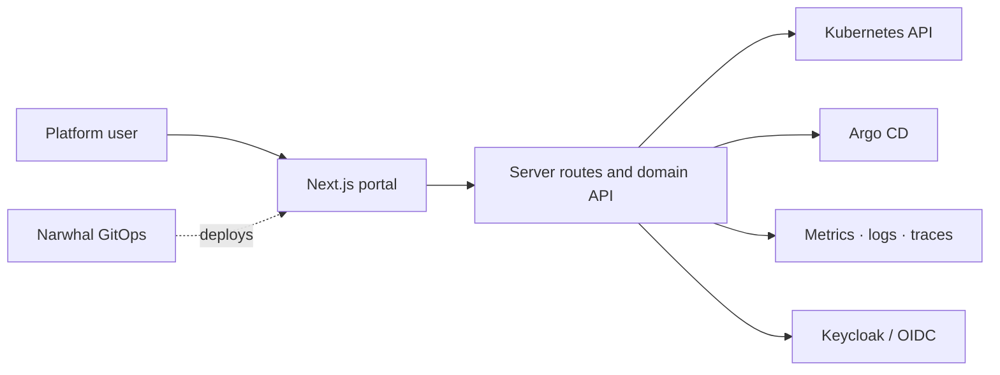
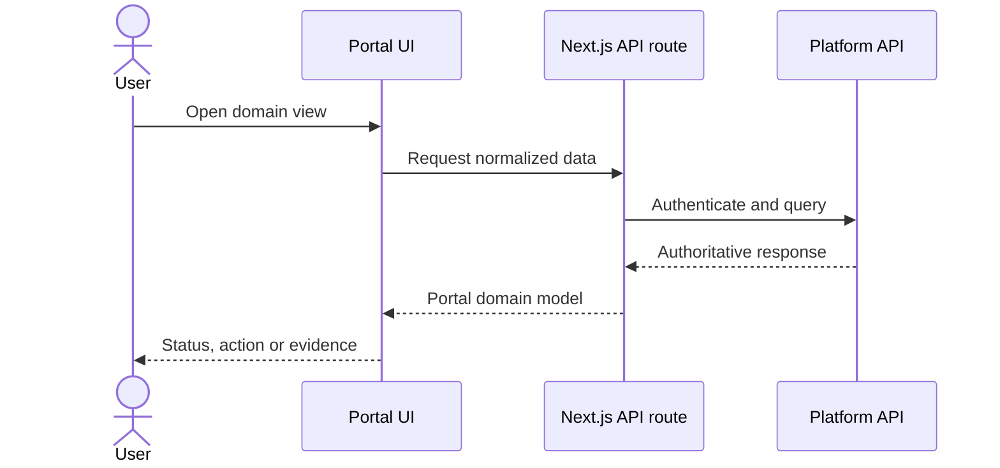

# Architecture

Narwhal Portal is the user-facing control surface for a Narwhal platform. It presents cluster, delivery, security, cost and observability data through one domain-oriented UI without replacing the systems that remain authoritative for that data.

## System context

```mermaid
flowchart LR
    U["Platform user"] --> W["Next.js portal"]
    W --> B["Server routes and domain API"]
    B --> K["Kubernetes API"]
    B --> G["Argo CD"]
    B --> O["Metrics · logs · traces"]
    B --> I["Keycloak / OIDC"]
    N["Narwhal GitOps"] -. deploys .-> W
```

The portal reads and orchestrates platform APIs. Kubernetes, Argo CD, the identity provider and observability backends remain systems of record.

## Application layers

| Layer | Source | Responsibility |
|---|---|---|
| Routes and layouts | `src/app/` | Dashboard navigation, login and server-rendered pages |
| API boundary | `src/app/api/` | Health, cluster, catalog, templates, scorecards, cost, security and telemetry endpoints |
| UI composition | `src/components/` | Reusable visual and domain components |
| Client state | `src/hooks/`, `src/lib/` | Fetching, normalization, auth helpers and domain clients |
| Contracts | `src/types/`, `protos/` | TypeScript and flow/observer/relay integration contracts |
| Runtime packaging | `deploy/`, `config/` | Container deployment and environment-specific configuration |

## Request flow

```mermaid
sequenceDiagram
    actor User
    participant UI as Portal UI
    participant API as Next.js API route
    participant Source as Platform API
    User->>UI: Open domain view
    UI->>API: Request normalized data
    API->>Source: Authenticate and query
    Source-->>API: Authoritative response
    API-->>UI: Portal domain model
    UI-->>User: Status, action or evidence
```

## Trust and deployment boundaries

- Browser code never receives Kubernetes service-account credentials.
- Server routes are the integration boundary for cluster and platform APIs.
- OIDC establishes user identity; authorization is still checked at the called service.
- Runtime configuration is injected through deployment resources, not bundled into the UI.
- Correlated data with uncertain relationships is labeled instead of presented as authoritative.

## Caching contract

Every Valkey cache key (`src/lib/valkey.ts`'s `cacheGet`/`cacheSet`/`cacheDel`) is built from
explicit named dimensions in [`src/lib/cache-keys.ts`](../src/lib/cache-keys.ts) — namespace,
schema version, `cluster_id` (via `clusterCacheKey`, `src/lib/cluster-registry.ts`), and
authorization scope (via `EffectiveScope.fingerprint`, `src/lib/scope.ts`) — rather than a
hand-written template string per route. `CACHE_NAMESPACES` in that module is the full documented
contract (dimensions / TTL / invalidation trigger / whether a partial provider response is ever
cached) for every namespace in the codebase, and
[`cache-keys.contract.test.ts`](../src/lib/cache-keys.contract.test.ts) enforces it: every
namespace whose cached value differs by caller identity, team, role, or cluster must carry a
matching dimension, and no namespace caches a failed/partial provider fetch.

`src/lib/argocd.ts`, `src/lib/gitea.ts`, `src/lib/http-client.ts`, and `src/lib/keycloak-client.ts`
(`KEYCLOAK_CACHE_KEYS`, already centralized per #49) own their own key construction and are
referenced in the registry for completeness rather than migrated into this module.

## Outbound HTTP transport policy

Outbound HTTP calls to platform dependencies (Argo CD, Gitea, Prometheus, Keycloak, APISIX,
Kubernetes API, OpenBao, Alertmanager, Falco/Loki) are standardized through the shared transport
client in [`src/lib/http-client.ts`](../src/lib/http-client.ts).

Detailed transport reference and matrix: [`docs/outbound-http-policy.md`](./outbound-http-policy.md).

### Transport guarantees and error model

- **Transport failures (`HttpClientError`)**: Transport-level failures throw `HttpClientError`
  ([`src/lib/http-client.ts:98-116`](../src/lib/http-client.ts#L98-L116)) with normalized
  `kind: HttpClientErrorKind` (`"timeout" | "network" | "aborted"`,
  [`src/lib/http-client.ts:90`](../src/lib/http-client.ts#L90)).
- **HTTP status responses**: Non-retried HTTP status outcomes (including 401, 403, 500, and
  exhausted 429/502/503/504) return the `Response` object
  ([`src/lib/http-client.ts:350-353, 413`](../src/lib/http-client.ts#L350-L353)). Callers evaluate
  `response.ok` or `response.status` according to domain requirements.
- **Redaction**: URL query parameters and user credentials (`scheme://user:pass@`) are stripped
  via `redactUrl()` ([`src/lib/http-client.ts:122-134`](../src/lib/http-client.ts#L122-L134)). Headers
  (such as `Authorization` or `X-Vault-Token`) are never leaked into error messages.
- **Deadline-bounded body reads**: `fetchWithPolicy` records remaining attempt time
  `Math.max(0, timeoutMs - elapsed)` in `bodyDeadlines`
  ([`src/lib/http-client.ts:252, 412-413`](../src/lib/http-client.ts#L252)). Bodies read via
  `readJsonWithPolicy` ([`src/lib/http-client.ts:338`](../src/lib/http-client.ts#L338)) or
  `readTextWithPolicy` ([`src/lib/http-client.ts:343`](../src/lib/http-client.ts#L343)) must complete
  within that budget; stalled streams are aborted and throw `kind: "timeout"`.
- **Response byte-size limits**: Body-read time is deadline-bounded; response byte sizes are
  currently unbounded at the transport client layer
  ([`src/lib/http-client.ts:26-27`](../src/lib/http-client.ts#L26-L27)).
- **Circuit breaker**: Per-provider circuit breakers are not implemented in this layer
  ([`src/lib/http-client.ts:27-28`](../src/lib/http-client.ts#L27-L28)).

### Timeout classes

`fetchWithPolicy` enforces `timeoutMs` per attempt ([`DEFAULT_TIMEOUT_MS = 10_000`](../src/lib/http-client.ts#L51)).
The budget covers connection establishment and response headers; remaining time bounds body streaming.

| Timeout class | Connect + headers | Body read | Total per attempt | Used by (callers in `src/lib/`) | Constants / source citations |
|---|---|---|---|---|---|
| **Cluster probe** | Up to 2s | Remaining of 2s | 2s | Kubernetes cluster version health probe | [`src/lib/domain/cluster.ts:221`](../src/lib/domain/cluster.ts#L221) (`timeoutMs = 2000`) |
| **Fast probe / Telemetry read** | Up to 5s | Remaining of 5s | 5s | Argo CD reads (`argoFetch`) Gitea commit timestamp (`getCommitTimestamp`) Alertmanager silences list (`getAlertmanagerSilences`) APISIX routes query (`getRoutes`) Prometheus instant query (cost) Loki logs query (Falco) Kubernetes node status probe (Hero) Dependency health probe (`probeHttpDependency`) | [`src/lib/argocd.ts:81`](../src/lib/argocd.ts#L81) (`timeoutMs = 5000`) [`src/lib/gitea.ts:270`](../src/lib/gitea.ts#L270) (`timeoutMs: 5000`) [`src/lib/alertmanager.ts:96`](../src/lib/alertmanager.ts#L96) (`timeoutMs: 5000`) [`src/lib/apisix-client.ts:65`](../src/lib/apisix-client.ts#L65) (`timeoutMs: 5000`) [`src/lib/cost.ts:193`](../src/lib/cost.ts#L193) (`PROM_TIMEOUT_MS = 5000`) [`src/lib/falco.ts:99`](../src/lib/falco.ts#L99) (`timeoutMs: 5000`) [`src/lib/hero.ts:202`](../src/lib/hero.ts#L202) (`timeoutMs: 5000`) [`src/lib/dependency-health.ts:166`](../src/lib/dependency-health.ts#L166) (`DEFAULT_PROBE_TIMEOUT_MS = 5000`) |
| **Standard / Default** | Up to 10s | Remaining of 10s | 10s | Client default fallback Argo CD sync (`syncArgoApp`) & rollback (`rollbackArgoApp`) Gitea API mutations (`api`) APISIX route plugin toggle (`toggleRoute`) Prometheus queries (`queryPrometheusVector`, range) Prometheus range query (cost) Service graph Prometheus queries Alertmanager silence create / expire Keycloak admin token & operations OpenBao auth login & KV secret reads/writes Kubernetes Job delete | [`src/lib/http-client.ts:51`](../src/lib/http-client.ts#L51) (`DEFAULT_TIMEOUT_MS = 10_000`) [`src/lib/argocd.ts:251, 286`](../src/lib/argocd.ts#L251) [`src/lib/gitea.ts:93`](../src/lib/gitea.ts#L93) [`src/lib/apisix-client.ts:85`](../src/lib/apisix-client.ts#L85) [`src/lib/prometheus.ts:232, 361, 441`](../src/lib/prometheus.ts#L232) [`src/lib/cost.ts:195`](../src/lib/cost.ts#L195) (`PROM_RANGE_TIMEOUT_MS = 5000`) [`src/lib/service-graph.ts:89`](../src/lib/service-graph.ts#L89) [`src/lib/alertmanager.ts:38, 77`](../src/lib/alertmanager.ts#L38) [`src/lib/keycloak-client.ts:93, 172`](../src/lib/keycloak-client.ts#L93) [`src/lib/openbao.ts:136, 192, 202`](../src/lib/openbao.ts#L136) [`src/lib/k8s-job-runner.ts:78`](../src/lib/k8s-job-runner.ts#L78) |
| **Kubernetes batch / Long-read** | Up to 60s | Remaining of 60s | 60s | Kubernetes pagination & lists (`listBounded`) Kubernetes generic resource queries (`getNamespaces`) Kubernetes job runner API fetch (`k8sFetch`) Compliance audit evaluation Security scorecard inspection Trivy vulnerability report fetching | [`src/lib/k8s-client.ts:48`](../src/lib/k8s-client.ts#L48) (`timeoutMs: 60_000`) [`src/lib/k8s-job-runner.ts:52, 64`](../src/lib/k8s-job-runner.ts#L52) [`src/lib/compliance.ts:33`](../src/lib/compliance.ts#L33) [`src/lib/scorecard.ts:73`](../src/lib/scorecard.ts#L73) [`src/lib/trivy.ts:22`](../src/lib/trivy.ts#L22) |
| **Kubernetes job execution budget** | Clamped 1s–10s per poll | Budget remaining | Max 300s total | Kubernetes asynchronous tuning/batch job execution | [`src/lib/k8s-job-runner.ts:133, 218`](../src/lib/k8s-job-runner.ts#L133) (`timeoutMs = 5 * 60_000`, `jobStatusPollTimeoutMs`) |

### Retry policy matrix

Retry configuration defaults:
- Max attempts: `DEFAULT_MAX_ATTEMPTS = 3` ([`src/lib/http-client.ts:52`](../src/lib/http-client.ts#L52))
- Base backoff delay: `DEFAULT_BASE_DELAY_MS = 200` ([`src/lib/http-client.ts:53`](../src/lib/http-client.ts#L53))
- Maximum backoff delay: `DEFAULT_MAX_DELAY_MS = 5_000` ([`src/lib/http-client.ts:54`](../src/lib/http-client.ts#L54))
- Backoff algorithm: Full-jitter exponential backoff `Math.random() * Math.min(maxDelayMs, baseDelayMs * 2 ** (attempt - 1))` ([`src/lib/http-client.ts:143-146`](../src/lib/http-client.ts#L143-L146))
- Retry-After header: For 429, honored if present (delta-seconds or HTTP-date), clamped to `maxDelayMs` ([`src/lib/http-client.ts:151-159`](../src/lib/http-client.ts#L151-L159))
- Idempotent methods eligible for retry: `GET`, `HEAD`, `PUT`, `DELETE`, `OPTIONS` ([`IDEMPOTENT_METHODS`, src/lib/http-client.ts:32-38`](../src/lib/http-client.ts#L32-L38))
- Retryable status codes: `429`, `502`, `503`, `504` ([`RETRYABLE_STATUS`, src/lib/http-client.ts:46`](../src/lib/http-client.ts#L46))
- Body release on retry: Response body is drained and cancelled via `cancelBody(response)` before backing off ([`src/lib/http-client.ts:398`](../src/lib/http-client.ts#L398))

| Operation category | Failure condition | Retried? | Attempts / Backoff schedule | Rationale / Source citation |
|---|---|---|---|---|
| **Idempotent read / mutation** (`GET`, `HEAD`, `PUT`, `DELETE`, `OPTIONS`) with default retry | Network error / Connection reset (`ECONNRESET`, `TypeError: fetch failed`, DNS drop) | **Yes** | Up to 3 attempts. Full-jitter backoff: `0..min(5s, 200ms * 2^(attempt-1))`. | Transient transport interruption. [`src/lib/http-client.ts:421-424`](../src/lib/http-client.ts#L421-L424) |
| **Idempotent read / mutation** (`GET`, `HEAD`, `PUT`, `DELETE`, `OPTIONS`) with default retry | HTTP 429 Too Many Requests | **Yes** | Up to 3 attempts. Honors `Retry-After` header (clamped to 5s); fallback to full-jitter. | Upstream explicitly requests delayed retry. [`src/lib/http-client.ts:400-405`](../src/lib/http-client.ts#L400-L405) |
| **Idempotent read / mutation** (`GET`, `HEAD`, `PUT`, `DELETE`, `OPTIONS`) with default retry | HTTP 502 / 503 / 504 Gateway / Service errors | **Yes** | Up to 3 attempts. Drains response body, full-jitter backoff: `0..min(5s, 200ms * 2^(attempt-1))`. | Transient gateway/server outage. [`src/lib/http-client.ts:394-406`](../src/lib/http-client.ts#L394-L406) |
| **Idempotent read / mutation** (`GET`, `HEAD`, `PUT`, `DELETE`, `OPTIONS`) with default retry | HTTP 500 Internal Server Error / 501 Not Implemented | **No** | 1 attempt. Returns `Response(status: 500/501)`. | D1: 500/501 indicate application defects; retrying multiplies load on broken upstreams. [`src/lib/http-client.ts:40-46`](../src/lib/http-client.ts#L40-L46) |
| **Idempotent read / mutation** (`GET`, `HEAD`, `PUT`, `DELETE`, `OPTIONS`) with default retry | HTTP 401 Unauthorized / 403 Forbidden | **No** (transport layer) | 1 attempt. Returns `Response(status: 401/403)`. | Auth failure; caller-level logic may refresh tokens (e.g. `k8s-client.ts:53`, `keycloak-client.ts:194`, `openbao.ts:201`). |
| **Idempotent read / mutation** (`GET`, `HEAD`, `PUT`, `DELETE`, `OPTIONS`) with default retry | Request timeout (`timeoutMs` elapsed) | **No** | 1 attempt. Throws `HttpClientError(kind: "timeout")`. | Timed-out requests do not retry to avoid latency compounding. [`src/lib/http-client.ts:420-425`](../src/lib/http-client.ts#L420-L425) |
| **Idempotent read / mutation** (`GET`, `HEAD`, `PUT`, `DELETE`, `OPTIONS`) with default retry | Body read timeout (deadline elapsed mid-read) | **No** | 1 attempt. Cancels stream reader, throws `HttpClientError(kind: "timeout")`. | Prevents hanging indefinitely on stalled response bodies. [`src/lib/http-client.ts:321-325`](../src/lib/http-client.ts#L321-L325) |
| **Any operation** | Caller signal aborted (`signal.aborted === true`) | **No** | 1 attempt. Immediately throws `HttpClientError(kind: "aborted")`. | Inbound request cancelled by caller; must not be retried. [`src/lib/http-client.ts:416-425`](../src/lib/http-client.ts#L416-L425) |
| **Non-idempotent mutation** (`POST`, `PATCH`, or non-standard methods) | Any failure (Network, 429, 5xx, timeout) | **No** | 1 attempt (`maxAttempts = 1`). Returns `Response` on HTTP status or throws `HttpClientError`. | Prevents duplicate mutations (e.g. duplicated git commits, duplicate sync triggers). [`src/lib/http-client.ts:373-374`](../src/lib/http-client.ts#L373-L374) |
| **Explicit single-shot callers** (`retry: false`, e.g. `K8S_POLICY`, `PROM_POLICY`, Keycloak admin PUT/DELETE, OpenBao login, Alertmanager silence delete) | Any failure (Network, 429, 5xx, timeout) | **No** | 1 attempt (`maxAttempts = 1`). | Protects against fighting Kubernetes APF rate limits, overloading Prometheus during scrape bursts, or repeating admin state mutations. [`src/lib/k8s-client.ts:16`](../src/lib/k8s-client.ts#L16), [`src/lib/prometheus.ts:11`](../src/lib/prometheus.ts#L11), [`src/lib/keycloak-client.ts:182`](../src/lib/keycloak-client.ts#L182) |

## Live event pipeline

The live event path stores a bounded replay ring in Valkey and publishes each event on a
dedicated pub/sub channel. The SSE route subscribes before reading the replay snapshot, then
uses the snapshot's high-water ID to discard overlap between replay and live delivery.

| Condition | Behavior |
|---|---|
| Cursor is retained | Replay events strictly after the cursor, then continue live delivery |
| Cursor predates the retained ring | Send `replay-gap` with `state: "gap"`; the client must refresh its snapshot |
| Cursor cannot be established | Send `replay-gap` with `state: "unknown"`; the client must refresh its snapshot |
| Valkey is unavailable | Keep a process-local ring and IDs for best-effort delivery; events can be lost on restart or replica change |

The Valkey replay ring retains the newest 1,000 events. Ordering and replay boundaries use
only the integer from the shared Valkey `INCR` counter. If `INCR` fails, the publisher uses a
`d-<epoch-ms>-<local-seq>` ID and still attempts to persist and publish the event. Degraded IDs
are non-comparable with shared counters; they replay only when the exact ID is still in the
same process's in-memory ring. Other degraded cursors are reported as `unknown`. Client abort
signals end the subscription and release its pub/sub listener and connection.

The admin-only `/api/health/dependencies` response includes in-process `liveStream` metrics:

| Metric | Meaning |
|---|---|
| `acceptedIngests` | Ingest requests accepted and sent to the live pipeline |
| `duplicateIngests` | Requests rejected as duplicates by idempotency |
| `incrFailures` | Failures obtaining the shared Valkey event ID with `INCR`; during a full Valkey outage, one `pushEvent` increments this and `writeFailures`, so summing them overstates distinct events |
| `writeFailures` | Failures writing the replay ring or publishing the event; during a full Valkey outage, one `pushEvent` increments this and `incrFailures`, so summing them overstates distinct events |
| `subscribeFailures` | Failures subscribing an SSE consumer to pub/sub |
| `degradedEntries` | Transitions from healthy into degraded mode |
| `recoveries` | Transitions from degraded back to healthy |
| `replayInWindow` | Replay requests resolved within the retained window |
| `replayGaps` | Replay requests whose cursor predates retained events |
| `replayUnknown` | Replay requests whose cursor could not be established |
| `connectedClients` | Current SSE clients connected to this process (gauge) |
| `disconnectCleanups` | SSE client disconnects that ran subscription cleanup |

All metrics except `connectedClients` are monotonic counters. They are process-local, reset on
process restart, and report only the replica serving the admin request. Prometheus scraping and
aggregation are future cluster-side work; this endpoint does not provide cluster-wide totals.

## Relationship to Narwhal

This repository owns portal code and packaging. The [Narwhal repository](https://github.com/dasomel/narwhal) owns cluster provisioning, GitOps applications, gateways, identity and platform services. A new cluster capability therefore needs a portal contract here and deployment/configuration in Narwhal separately.
